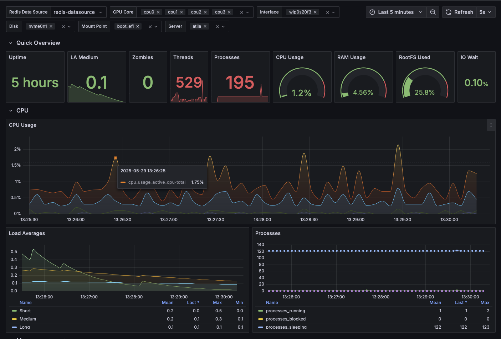

# Linux System Overview Dashboard

This dashboard provides a comprehensive view of Linux system metrics collected by RTCollector. It visualizes key performance indicators for CPU, memory, disk, network, and process statistics.

## Features

- **System Overview**: CPU usage, memory usage, load average, and uptime
- **CPU Metrics**: Per-core CPU usage with breakdown by user, system, and idle time
- **Memory Usage**: Physical and virtual memory usage, including swap
- **Disk Usage**: Space usage by mount point and disk I/O statistics
- **Network Traffic**: Bandwidth usage, packet counts, and errors by interface
- **Process Statistics**: Running processes, threads, and process states
- **RTCollector Performance**: Internal metrics about the collector itself

## Variables

The dashboard includes the following variables for filtering:

- **Server**: Select one or more hosts to display
- **CPU Core**: Filter CPU metrics by specific cores
- **Interface**: Filter network metrics by specific interfaces
- **Disk**: Filter disk I/O metrics by specific disks
- **Mount Point**: Filter disk usage metrics by specific mount points

## How to Import

1. Download the JSON file from this directory
2. In Grafana, navigate to Dashboards > Import
3. Upload the JSON file or paste its contents
4. Select your Redis data source
5. Click Import

## Requirements

- Grafana 9.x or newer
- Redis Data Source for Grafana
- RedisTimeSeries database with metrics from RTCollector
- RTCollector configured with these input plugins:
  - linux_cpu
  - linux_mem
  - linux_disk
  - linux_io
  - linux_net
  - linux_swap
  - system
  - processes
  - internal

## Troubleshooting

- If no data appears, check that RTCollector is running and collecting metrics
- Verify that the Redis data source is correctly configured in Grafana
- Ensure that the time range includes data points
- Check that the variables are correctly set (especially the server variable)
- For mount point issues, verify that the mount labels match what's in your Redis database